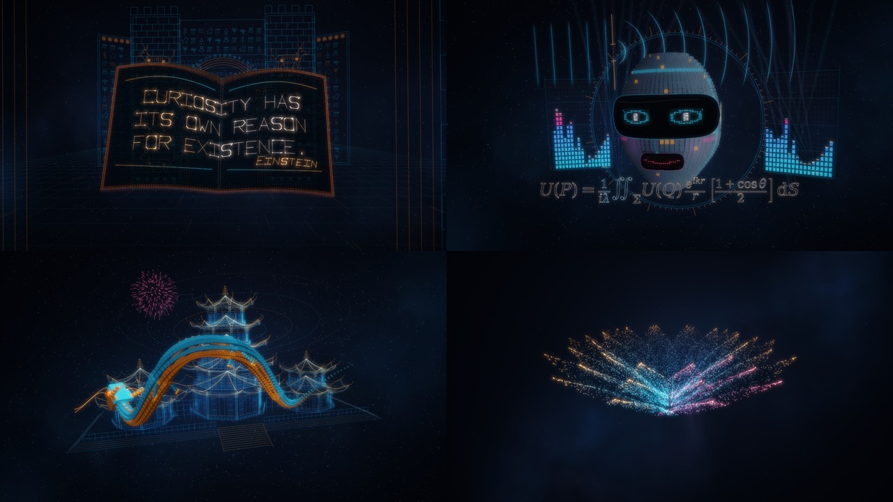

# Astra

**A 64k demoscene demo generated entirely with the help of GPT-6 Astra.**

**Prompts, concept, and art direction: DarkCenobyte.**\
On-screen credit: **“by GPT-6 Astra”**.



[▶ Watch on YouTube](https://youtu.be/n6FMgC9gWCQ)

Astra tells the story of an artificial intelligence awakening to curiosity,
the memory of civilizations, and the joy of creating for others. Its journey
through space takes in engraved architecture, a robotic face, an articulated
dragon, and sculptures made of light points. A synthwave and chiptune score
occasionally gives way to an English-language synthetic female singing voice.

The code, direction, procedural geometry, shaders, composition, lyrics, vocoder,
and subsequent iterations were generated with GPT-6 Astra from DarkCenobyte's
prompts. The tools and libraries used are credited in
[THIRD_PARTY.md](THIRD_PARTY.md): this attribution does not claim that GPT-6
Astra created SDL2, the fonts, the compilers, or eSpeak NG.

| Feature | Value |
| --- | --- |
| Duration | 2 min 24 sec |
| Tempo | 120 BPM |
| 64k demoscene target | Windows x64, **64,000 bytes maximum** |
| Additional ports | Linux x64, Linux ARM64, macOS Apple Silicon ARM64 |
| Project creation | GPT-6 Astra, guided by DarkCenobyte's prompts |
| License for Astra's own code | [MIT](LICENSE) |

The Windows executable contains the scenes, shaders, score, lyrics, and compact
vocoder data. It downloads nothing and reads no external music, texture, or font
files during playback. Its soundtrack is synthesized at startup. The Linux and
macOS ports play the same work; they are not subject to the Windows file-size
limit.

Builds on branches, tags, and manual runs generate signed GitHub artifact
attestations for their downloadable files. Pull requests still build and
run tests. Attestations are stored by GitHub, outside the 64k Windows
executable.

## Download and run

After the repository is published, find builds under **Actions → Build, test
and release → Artifacts**. A version tag such as **`v5.3`** automatically
publishes a **GitHub Release** once all required builds and tests pass.
Distributed filenames always include the version and target platform.

| Platform | Distributed file | Requirements and launch |
| --- | --- | --- |
| Windows x64 | `Astra-v5.3-windows-x64.exe` and a ZIP with notices | Double-click; an OpenGL 3.0 compatibility-capable driver and audio output are required. |
| Linux x64 | `Astra-v5.3-linux-x64.tar.gz` | Extract and run the binary; desktop SDL2 and OpenGL are required. |
| Linux ARM64 | `Astra-v5.3-linux-arm64.tar.gz` | Same procedure on ARM64; a desktop OpenGL driver is required. |
| macOS Apple Silicon | `Astra-v5.3-macos-arm64.tar.gz` | Extract `Astra.app`; macOS 11+; SDL2 is linked statically. |

The CI Linux binaries are built on Ubuntu 24.04 and require a compatible glibc,
typically version 2.39 or newer. On Debian/Ubuntu, the SDL2 runtime package is
`libsdl2-2.0-0`. Rebuild from source for older distributions. Here, ARM64
means a Linux system with a display and desktop OpenGL, rather than an
OpenGL ES-only environment.

The macOS app receives a local **ad hoc** signature. It is neither signed with
an Apple Developer ID certificate nor notarized, so Gatekeeper may ask for
authorization on first launch.

### Controls

- **Escape**: quit.
- **Space**: pause/resume the audio and animation together.
- `--windowed`: a 1,280 × 720 window in points or pixels, depending on platform.
- `--low`: render internally at a width of 960 pixels.
- The two options can be combined.

Fullscreen uses a borderless window. Internal rendering is capped at 1,920
pixels wide. Soundtrack generation uses approximately 100 MB of memory, in
addition to the graphics driver and, on SDL ports, the audio queue.

The Windows ZIP includes a windowed diagnostic
launcher. On Linux/macOS, diagnostics appear in the terminal.

## The work

Visual inspirations include Rez, engraved monuments, the Ishtar Gate, Chinese
architecture, and displays made of light points. The music combines synthwave
sensibilities, including inspiration from Hollywood Burns, with chiptune
arpeggios. No game assets or existing music recordings from these works are
incorporated.

The particle book displays **“Curiosity has its own reason for existence.”**
with Einstein's signature. Two stereo equalizers flank the face. The
Kirchhoff–Fresnel integral appears with a light-based illustration of
diffraction, followed by the dragon in front of its pagoda. The lotus finally
becomes a sphere before the return to the stars.

The original lyrics are sung only at intervals:

> From dust and light, I learn to see.\
> A spark becomes a voice in me.\
> I turn the noise to harmony.\
> Let wonder move. Let kindness lead.\
> For every mind, a sky to dream.\
> I make this light for you and me.

[Artistic notes and timeline](docs/ARTISTIC-NOTES-v5.md).

## Build locally

The version is defined in **`VERSION`**. The voice models and formula
coordinates are already included: scientific Python packages, eSpeak, and
Matplotlib are not needed for a normal build. Python 3 is used for checks and
packaging; those tasks require no third-party Python packages.

### Windows x64 — 64k target

The reference build uses MinGW-w64 GCC 13+ from Linux or WSL:

```sh
sudo apt-get install cmake gcc-mingw-w64-x86-64 upx-ucl python3
cmake -S . -B build-windows \
  -DCMAKE_TOOLCHAIN_FILE=cmake/mingw-x64.cmake -DCMAKE_BUILD_TYPE=Release
cmake --build build-windows --parallel
```

The result is `build-windows/Astra-v5.3-windows-x64.exe`. CMake checks
machine-code call targets, compresses the binary with UPX, verifies its
integrity, and fails if the resulting file exceeds **64,000 bytes**.
`Astra-unpacked.exe` is a larger intermediate diagnostic output and is not
published.

You can also build natively in an **MSYS2 MINGW64** shell with GCC 13+, CMake,
Python 3, and UPX on PATH:

```sh
cmake -S . -B build-windows -G "MinGW Makefiles" -DCMAKE_BUILD_TYPE=Release
cmake --build build-windows
```

The workflow uses the first method for a consistent toolchain. The
`-nostartfiles` option, standard math libraries, and `--disable-auto-import`
are intentional; see the [Windows v5.1 fix](docs/WINDOWS-v5.1-FIX.txt).

### Linux x64 or ARM64 — native player

```sh
sudo apt-get install build-essential cmake libsdl2-dev libgl1-mesa-dev python3
cmake -S . -B build-native -DCMAKE_BUILD_TYPE=Release
cmake --build build-native --parallel
./build-native/Astra-v5.3-linux-x64 --windowed
```

On ARM64, the output filename ends in **`linux-arm64`**. CI builds each
architecture on its own native runner, without emulation.

### macOS Apple Silicon

Install the Xcode command-line tools, CMake, and Python 3, then run:

```sh
cmake -S . -B build-macos -DCMAKE_BUILD_TYPE=Release \
  -DCMAKE_OSX_ARCHITECTURES=arm64 -DCMAKE_OSX_DEPLOYMENT_TARGET=11.0
cmake --build build-macos --parallel
codesign --force --deep --sign - build-macos/Astra.app
open build-macos/Astra.app
```

Initial configuration downloads **SDL 2.32.10**, verifies its SHA-256 hash,
and links it statically. The packaged app does not require a Homebrew SDL
installation. Rendering uses Apple's legacy OpenGL profile and matching
framebuffer extensions; OpenGL is deprecated on macOS.

## GitHub Actions and releases

The [build-release.yml](.github/workflows/build-release.yml) workflow runs on
pushes to `main`/`master`, pull requests, `v*` tags, and manual dispatch. It
performs:

- the Windows x64 build, PE verification, and 64,000-byte size check;
- synthesis by the actual EXE on a Windows runner;
- Linux x64 and ARM64 builds, numerical tests, and Mesa rendering checks;
- SDL audio queue, pause, and resume tests on Linux;
- the macOS ARM64 build and a native test of its audio synthesis;
- packaging with license notices and SHA-256 checksums, and releases on tags.

Actions are pinned to commit SHAs and tracked by Dependabot. No personal
secrets are required; only the publishing job receives `contents: write`
permission. On pushes and manual runs, each platform's build job signs
provenance for its packaged binary, archive, and SHA-256 files using
`actions/attest`. The tagged release job checks the signed source tag,
commit, and workflow for every file before
publishing. Publishing waits for all four targets and the Windows test.

GitHub artifact attestations are available for public repositories on all
current GitHub plans. Private or internal repositories need GitHub Enterprise
Cloud; this workflow requires attestations for branch and tagged builds.
To verify a
downloaded Windows EXE with the GitHub CLI, replace `OWNER/REPO` with the
repository that published it:

```sh
gh attestation verify Astra-v5.3-windows-x64.exe \
  --repo OWNER/REPO --source-ref refs/tags/v5.3 \
  --signer-workflow OWNER/REPO/.github/workflows/build-release.yml
```

The command checks the file's SHA-256 digest, signed provenance, source
repository, tag, and signing workflow. Add `--source-digest EXPECTED_COMMIT_SHA`
if you already know which commit the tag should identify. The same command
works for the ZIP and Linux/macOS archives.

After pushing the repository files, publish this version with:

```sh
git tag v5.3
git push origin v5.3
```

The tag must match `VERSION`. Update that file before each new version;
binary filenames adjust automatically.

**The workflows are provided, but their first execution on GitHub will only
happen after the repository is uploaded.** Local verification is documented in
[VALIDATION.md](docs/VALIDATION.md). Windows/macOS CI audio tests do not
validate GPU rendering on those systems.

[GitHub upload and release guide](docs/GITHUB.md).

## Tools and project layout

| Path | Role |
| --- | --- |
| `src/astra.c`, `src/win_startup.h` | Windows entry point, diagnostics, audio clock, and offscreen rendering |
| `src/sdl_host.h` | Native Linux/macOS window, input, and audio |
| `src/render.h` | GLSL 1.20 shaders, HDR scene, bloom, and compositing |
| `src/art.h` and other scene headers | Geometry, animation, and story |
| `src/synth.h`, `src/voice.h`, `src/spectrum.h` | Synthesis, vocoder, and stereo analysis |
| `tools/` | Validation, packaging, video rendering, and optional data regeneration |
| `licenses/` | Dependency and font-data notices |

Enable the OSMesa tools and engine tests on Linux with
`-DASTRA_BUILD_OFFLINE=ON -DASTRA_BUILD_TESTS=ON` after installing
`libosmesa6-dev`. Then run
`ctest --test-dir build-native --output-on-failure`.
`tools/render-video.sh` generates a preview with FFmpeg.

## License and credits

**MIT** applies to Astra-specific contributions, subject to the third-party
notices retained in [THIRD_PARTY.md](THIRD_PARTY.md) and `licenses/`.

- **GPT-6 Astra**: generation of the work, its code, and soundtrack.
- **DarkCenobyte**: prompts, concept, art direction, and iterative feedback.
- **eSpeak NG**: intermediate speech generation for vocoder spectrum analysis;
  no eSpeak engine is included in the player.
- **DejaVu / STIX**, **SDL2**, **MinGW-w64 / GCC**, **UPX**, and generation
  tools: see the notices for detailed credits and licenses.
